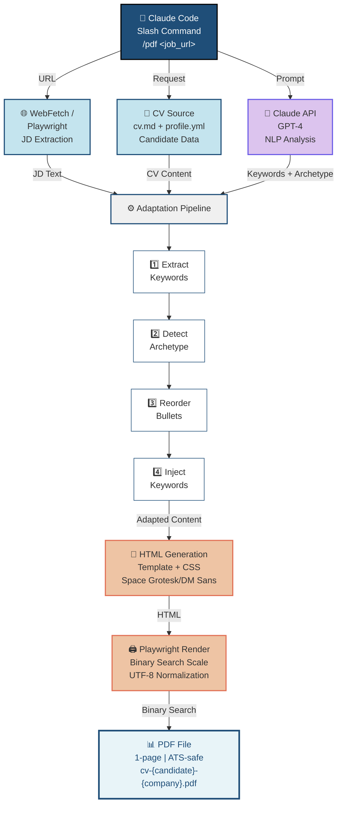
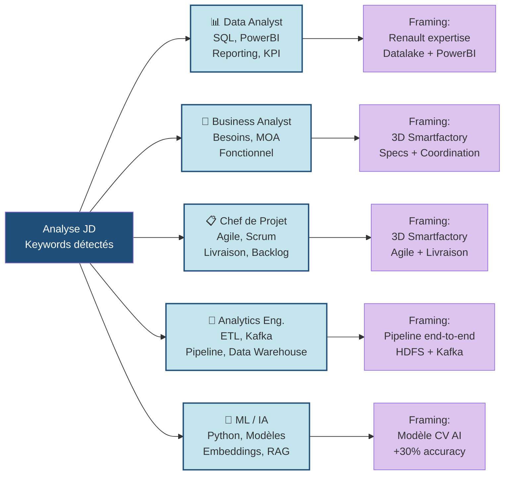
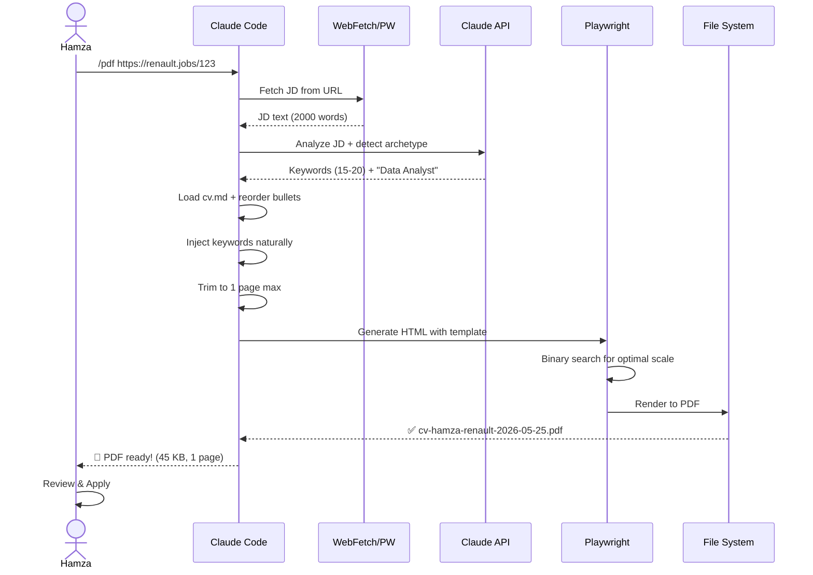

# Architecture cv-gen — Schémas Visuels

## 1. Diagramme de flux complet



---

## 2. Architecture en couches

```mermaid
graph LR
    subgraph Input["🔵 ENTRÉES"]
        I1["Claude Code<br/>CLI Interface"]
        I2["WebFetch /<br/>Playwright"]
        I3["CV Source<br/>cv.md"]
        I4["Claude API"]
    end
    
    subgraph Processing["🟢 TRAITEMENT"]
        P1["Extract JD<br/>Keywords"]
        P2["Detect<br/>Role Archetype"]
        P3["Match with<br/>Profile Rules"]
        P4["Reorder & Inject<br/>Keywords"]
    end
    
    subgraph Generation["🟡 GÉNÉRATION"]
        G1["HTML Builder<br/>Template + CSS"]
        G2["Playwright<br/>PDF Render"]
    end
    
    subgraph Output["🔴 RÉSULTAT"]
        O1["📄 PDF File<br/>1-page ATS-safe<br/>UTF-8 + accents"]
    end
    
    Input --> Processing
    Processing --> Generation
    Generation --> Output
    
    style Input fill:#d4e9f0
    style Processing fill:#e8f4e8
    style Generation fill:#f4e8d4
    style Output fill:#f0d4e8
```



---

## 3. Détail des 5 archétypes



---

## 4. Flux d'une candidature (scénario utilisateur)



---

## 5. Composants & Technologies

| Composant | Technologie | Rôle |
|-----------|-----------|------|
| **Frontend** | Claude Code Skill | Interface utilisateur, commande `/pdf` |
| **JD Extraction** | WebFetch + Playwright | Scraping portails d'emploi |
| **AI Analysis** | Claude API (GPT-4) | NLP: keywords + archétype |
| **CV Adaptation** | JavaScript Rules Engine | Récriture sélective, reformulation |
| **HTML Generation** | Vanilla JS + Template | Création du CV stylisé |
| **PDF Rendering** | Playwright + Chromium | Conversion HTML → PDF 1-page |
| **ATS Normalization** | generate-pdf.mjs | UTF-8 cleanup, accents preserved |
| **Storage** | File System | `/output/cv-*.pdf` |

---

## 6. Optimisations clés

### ✅ Une seule page
- **Binary search** pour trouver l'échelle optimale (0.6x à 1.0x)
- Contenu trimmé : max 4 bullets/poste, max 2 projets
- Recruteur lit en 6 secondes → force de la concision

### ✅ ATS-compatible
- Layout simple (1 colonne, pas de sidebars)
- UTF-8 natif avec accents français préservés
- Normalization: tirets, guillemets, espaces insécables
- Texte sélectionnable (pas d'images)

### ✅ Personnalisation intelligente
- 5 archétypes → 5 framings différents
- Keywords du JD injectés naturellement (jamais inventés)
- Expériences réordonnées par pertinence
- Bullets reformulées, pas copiées

---

## 7. Déploiement & Performance

```
Input: URL (job posting)
  ↓
Extraction JD: ~0.5 sec (WebFetch) ou ~3 sec (Playwright)
  ↓
AI Analysis: ~2 sec (Claude API)
  ↓
Adaptation: ~0.5 sec (local rules)
  ↓
HTML Generation: ~0.2 sec
  ↓
PDF Render: ~1-2 sec (binary search + Playwright)
  ↓
Output: PDF file (40-50 KB)
━━━━━━━━━━━━━━━━━━━━
Total: ~5-8 sec (sans Playwright) | ~7-12 sec (avec Playwright)

⚡ Optimisation future: caching des JD analysés (même poste = résultat réutilisable)
```

---

## 8. Contraintes & Cas limites

| Cas | Mitigation |
|-----|-----------|
| **JD derrière login** (LinkedIn) | Fallback Playwright avec headless browser |
| **JD trop court** (< 200 chars) | Demander à l'user de coller le texte |
| **Keywords mal détectés** | Few-shot prompting avec exemples |
| **PDF déborde 1 page** | Binary search réduit automat. l'échelle |
| **Accents corrompus** | UTF-8 native, normalisation avant PDF |
| **CV très long** | Réduction automatique bullets + projets |

---

## 9. Roadmap (après MVP)

### Phase 1 (Actuel) — MVP Minimal Viable
- ✅ 3 archétypes testés (Data, PM, Eng)
- ✅ Extraction JD + CV adaptation
- ✅ PDF 1-page + ATS-safe

### Phase 2 — Polish
- 📅 Tracking candidatures (Excel/DB)
- 📅 Feedback system (1-5 étoiles CV)
- 📅 Email templates (relance pré-remplie)

### Phase 3 — Growth (optionnel)
- 🚀 LinkedIn sync (auto-update CV source)
- 🚀 A/B testing (2 versions de summary)
- 🚀 Mobile app (consultation PDFs)

---

**Schéma SVG détaillé disponible:** `architecture-diagram.svg`
